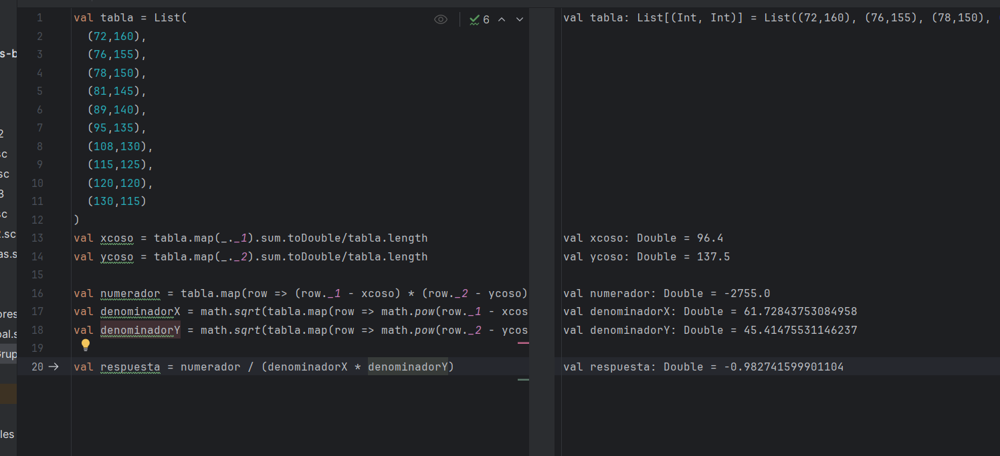

# Taller Grupal  1
## Estructuras de datos (Tuplas, Listas)

**Semana**: 4

**Objetivos**:

- Realizar operaciones con estructuras de datos (tuplas, listas).

### Descripción:

Formará grupos, por afinidad, de 4 integrantes. Cada grupo debe designar a un integrante como su líder que será el encargado de: organizar el grupo garantizando el trabajo de los demás integrantes, será el único que podrá plantear preguntas al tutor y sobretodo debe garantizar que todos comprenden el problema y la solución. Si el grupo lo considera necesario podrán cambiar de líder cuantas veces lo crean necesario.

### Ejercicio 1

Elabore un programa en Scala que a través de los principios de programación funcional resuelva el siguiente problema.

Calcular el coeficiente de correlación de Pearson para establecer si existe una relación entre el peso de una persona y su tensión sistólica.

| Peso (kg) | Tensión sistólica |
|-----------|--------------------|
| 72        | 160                |
| 76        | 155                |
| 78        | 150                |
| 81        | 145                |
| 89        | 140                |
| 95        | 135                |
| 108       | 130                |
| 115       | 125                |
| 120       | 120                |
| 130       | 115                |


> Defina una lista de tuplas para la colección de datos. 


### Fórmulas

1. **Fórmula general del coeficiente de correlación de Pearson**:

$$
r = \frac{\sum_{i=1}^{n} (x_i - \overline{x})(y_i - \overline{y})}{\sqrt{\sum_{i=1}^{n} (x_i - \overline{x})^2} \sqrt{\sum_{i=1}^{n} (y_i - \overline{y})^2}}
$$

2. **Cálculo de la media de \(x\) e \(y\)**:
   
$$
\overline{x} = \frac{\sum_{i=1}^{n} x_i}{n} \quad \text{y} \quad \overline{y} = \frac{\sum_{i=1}^{n} y_i}{n}
$$

**Donde**:
- \(n\) es el número total de observaciones en las listas de datos \(x\) e \(y\).

### Información para la interpretación de los resultados
> El coeficiente de correlación de Pearson (\(r\)) es una medida estadística que indica la fuerza y la dirección de la relación lineal entre dos variables. Es útil para determinar si un cambio en una variable se asocia con un cambio en la otra y qué tan fuerte es esa relación. Los valores de \(r\) van de -1 a 1.

```scala
val tabla = List(
  (72,160),
  (76,155),
  (78,150),
  (81,145),
  (89,140),
  (95,135),
  (108,130),
  (115,125),
  (120,120),
  (130,115)
)
val xcoso = tabla.map(_._1).sum.toDouble/tabla.length
val ycoso = tabla.map(_._2).sum.toDouble/tabla.length

val numerador = tabla.map(row => (row._1 - xcoso) * (row._2 - ycoso)).sum
val denominadorX = math.sqrt(tabla.map(row => math.pow(row._1 - xcoso, 2)).sum)
val denominadorY = math.sqrt(tabla.map(row => math.pow(row._2 - ycoso, 2)).sum)

val respuesta = numerador / (denominadorX * denominadorY)
```



#### Posibles casos para interpretar el coeficiente de correlación:

$$
\begin{array}{l}
r = 1: \text{ Correlación positiva perfecta.} \\
0.7 \leq r < 1: \text{ Correlación positiva fuerte.} \\
0.4 \leq r < 0.7: \text{ Correlación positiva moderada.} \\
0.1 \leq r < 0.4: \text{ Correlación positiva débil.} \\
r = 0: \text{ No hay correlación lineal.} \\
-0.4 < r \leq -0.1 : \text{ Correlación negativa débil.} \\
-0.7 < r \leq -0.4: \text{ Correlación negativa moderada.} \\
-1 < r \leq -0.7: \text{ Correlación negativa fuerte.} \\
r = -1: \text{ Correlación negativa perfecta.}
\end{array}
$$

### Preguntas a resolver
1. ¿El coeficiente de correlación es positivo o negativo?
Negativo
2. ¿Qué se puede concluir sobre la relación entre el peso y la tensión sistólica basándose en el coeficiente de correlación?
Se puede concluir que tiene una correlación negativa fuerte
3. Explique detalladamente lo que sucede en la línea de código donde se calcula el numerador y el denominador de la fórmula del coeficiente de correlación de Pearson.
En el xcoso comenzamos a calcular la suma de los valores en la columna 1 de nuestra fila y hacemos exactamente lo mismo para la columna 2
en el numerador recorremos la columna 1 y restamos cada valor por la media que calculamos en xcoso, hacemos lo propio con la columna 2 y multiplicamos entre sí
en denominadorX calculamos la raiz cuadrada al recorrer la columna 1 y restarla a la media siendo está xcoso, y el resultado de esta operacion lo elevamos al cuadrado antes de calcular la raiz cuadrada usando math.sqrt
en denominadorY calculamos la raiz cuadrada al recorrer la columna 2 y restarla a la media siendo está ycoso, y el resultado de esta operacion lo elevamos al cuadrado antes de calcular la raiz cuadrada usando math.sqrt
en respuesta calculamos la division entre numerador y la multiplicacion entre denominadorX y denominadorY
4. ¿Qué salida se esperaría si el coeficiente de correlación es calculado con datos donde la tensión sistólica aumenta a medida que el peso disminuye?
daria exactamente el mismo valor ya que son inversamente proporcionales

### Ejercicio 2
Definir una función `at100` de tipo `List[List[Int]]` que devuelve un dato de tipo `List[List[Int]]`, seleccionando solo aquellas listas internas cuyo valor más grande sea al menos 100.

```Scala
def at100(lists: List[List[Int]]): List[List[Int]] = {
  // completar
}

// Prueba de la función
val resultado = at100(List(List(0, 1, 100), List(60, 80), List(1000)))
println(resultado) // Salida esperada: List(List(0, 1, 100), List(1000))
```

### Calificación:

Para la calificación, se debe presentar el trabajo realizado a su tutor. Es necesario recalcar que la presentación se hace una única vez, no existe la posibilidad de presentaciones adicionales con correcciones. 

Tal como se le explicó anteriormente, los talleres se calificarán de la siguiente manera:

- 10 puntos si presenta en el horario de prácticas y experimentación.
- 7 puntos si presenta en el horario de tutoría

La hora máxima de presentación será las 09h20