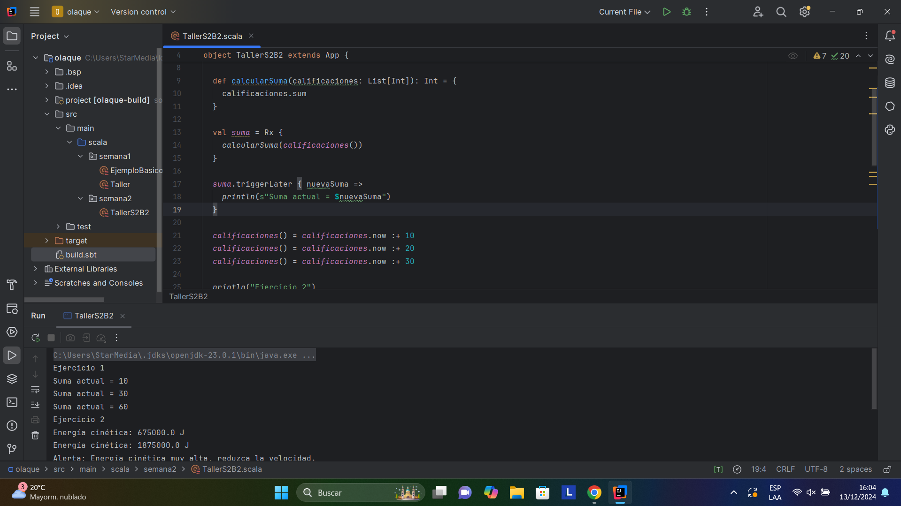

# Taller Individual  2
## Programación funcional reactiva

**Semana**: 10

**Objetivos**:

- Aplicar los conocimientos sobre programación funcional reactiva.

Resuelva los siguientes problemas.

### Problema 1: Suma de números

Crear un programa usando Rx que trabaje con una lista de números enteros (calificaciones) que cuando se actualiza se calcula automáticamente la suma de sus elementos y se almacena en la variable suma.

**Entrada esperada**
```yaml
calificaciones() = calificaciones.now :+ 10 // Agrega una calificación
calificaciones() = calificaciones.now :+ 20 // Agrega otra calificación
```

**Salida esperada**
```yaml
Suma actual = 20
Suma actual = 40
```

```scala
  val calificaciones = Var(List.empty[Int])

  def calcularSuma(calificaciones: List[Int]): Int = {
    calificaciones.sum
  }

  val suma = Rx {
    calcularSuma(calificaciones())
  }

  suma.triggerLater { nuevaSuma =>
    println(s"Suma actual = $nuevaSuma")
  }

  calificaciones() = calificaciones.now :+ 10
  calificaciones() = calificaciones.now :+ 20
  calificaciones() = calificaciones.now :+ 30
```

> Adjuntar capturas de ejecución


### Problema 2: Cálculo de la Energía Cinética de un Vehículo

Crea un programa que simule el monitoreo en tiempo real de la energía cinética de un vehículo en movimiento. El programa debe realizar las siguientes acciones:

1. **Utiliza una variable reactiva (`Var`)** para almacenar la masa del vehículo (`masa`) en kilogramos.
2. **Usa otra variable reactiva (`Var`)** para almacenar la velocidad del vehículo (`velocidad`) en metros por segundo.
3. **Calcula dinámicamente la energía cinética (`energiaCinetica`)** utilizando la fórmula:

   $$
   E_k = \frac{1}{2} m v^2
   $$

   Donde \(m\) es la masa y \(v\) es la velocidad.

4. **Cada vez que cambien la masa o la velocidad**:
   - Imprime en la consola el valor de la energía cinética calculada.
   - Si la energía cinética supera un umbral dado (por ejemplo, 1 000 000, muestra un mensaje indicando:  
     **"Alerta: Energía cinética muy alta, reduzca la velocidad."**


```scala
val masa = Var(1000)
  val velocidad = Var(30)

  val energiaCinetica = Rx {
    0.5 * masa() * Math.pow(velocidad(),2)
  }

  energiaCinetica.triggerLater { energia =>
    println(s"Energía cinética: $energia J")

    if (energia > 1000000) {
      println("Alerta: Energía cinética muy alta, reduzca la velocidad.")
    }
  }

  masa() = 1500
  velocidad() = 50

  masa() = 2000
  velocidad() = 60
```

> Adjuntar capturas de ejecución

### Calificación:

Una vez que termine debe presentar su trabajo a su docente.

- 10 puntos si presenta en el horario de prácticas y experimentación.
- 7 puntos presenta en el horario de tutoría

La hora máxima de presentación será las 16h30
