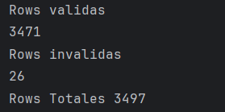
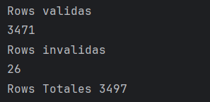
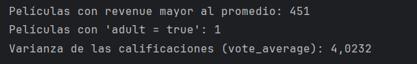

# Taller Grupal  1
## Programación funcional reactiva

**Semana**: 11

**Objetivos**:

- Crear un case class en Scala para modelar datos de un archivo CSV (data set de proyecto integrador).
- Manipular datos como una lista de objetos y realizar operaciones estadísticas.
- Comprender la relación entre datos y aplicar fórmulas estadísticas a análisis exploratorios.

> [!IMPORTANT]
> Resolver el siguiente problema en grupos según proyecto integrador (**solo estudiantes presentes en el aula**)

***


### Parte 1: Definición de case class y lectura de archivo

- Utilizando la case clase que construyó, como tarea, lea los datos del dataset de movies y trate de responder a las siguientes preguntas:

  Asegúrese que los atributos `popularity`, `runtime`, `vote_average` son de tipo real.

  - ¿Cuántas filas pudo leer?
  - ¿Cuántos filas son `Right`?
  - ¿Cuántos filas son `Left`?

- Ahora modifique el case class para que el atributo runtime sea del tipo
`Option[Double]` y vuelva a responder las preguntas anteriores.

```scala
package coso
import kantan.csv.generic._
import java.io.File
import kantan.csv._
import kantan.csv.ops._
case class Movies(
                   adult: Boolean,
                   belongs_to_collection: String,
                   budget: Int,
                   genres: String, // JSON como cadena
                   homepage: String,
                   id: Int,
                   imdb_id: String,
                   original_language: String,
                   original_title: String,
                   overview: String,
                   popularity: Double,
                   poster_path: String,
                   production_companies: String, // JSON como cadena
                   production_countries: String, // JSON como cadena
                   release_date: String,
                   revenue: Long,
                   runtime: Double,
                   spoken_languages: String, // JSON como cadena
                   status: String,
                   tagline: String,
                   title: String,
                   video: Boolean,
                   vote_average: Double,
                   vote_count: Int,
                   keywords: String, // JSON como cadena
                   cast: String, // JSON como cadena
                   crew: String, // JSON como cadena
                   ratings: String // JSON como cadena
                 )
object trabajoclase extends App {
  val path2DataFile2 = "coso/pi_movies_complete.csv"

  val dataSource2 = new File(path2DataFile2)
    .readCsv[List, Movies](rfc.withHeader.withCellSeparator(';'))

  val rows = dataSource2.collect {
    case Right(movie) => movie
  }
  val rowsFail = dataSource2.collect{
    case Left(error) => error
  }
  println("Rows validas")
  println(rows.length)
  println("Rows invalidas")
  println(rowsFail.length)
  println(s"Rows Totales ${rows.length + rowsFail.length}")
}
```

## Cambio
```scala
package coso
import kantan.csv.generic._
import java.io.File
import kantan.csv._
import kantan.csv.ops._
case class Movies(
                   adult: Boolean,
                   belongs_to_collection: String,
                   budget: Int,
                   genres: String, // JSON como cadena
                   homepage: String,
                   id: Int,
                   imdb_id: String,
                   original_language: String,
                   original_title: String,
                   overview: String,
                   popularity: Double,
                   poster_path: String,
                   production_companies: String, // JSON como cadena
                   production_countries: String, // JSON como cadena
                   release_date: String,
                   revenue: Long,
                   runtime: Option[Double],
                   spoken_languages: String, // JSON como cadena
                   status: String,
                   tagline: String,
                   title: String,
                   video: Boolean,
                   vote_average: Double,
                   vote_count: Int,
                   keywords: String, // JSON como cadena
                   cast: String, // JSON como cadena
                   crew: String, // JSON como cadena
                   ratings: String // JSON como cadena
                 )
object trabajoclase extends App {
  val path2DataFile2 = "coso/pi_movies_complete.csv"

  val dataSource2 = new File(path2DataFile2)
    .readCsv[List, Movies](rfc.withHeader.withCellSeparator(';'))

  val rows = dataSource2.collect {
    case Right(movie) => movie
  }
  val rowsFail = dataSource2.collect{
    case Left(error) => error
  }
  println("Rows validas")
  println(rows.length)
  println("Rows invalidas")
  println(rowsFail.length)
  println(s"Rows Totales ${rows.length + rowsFail.length}")
}
```


> Adjuntar código y capturas de ejecución

### Parte 2: Análisis de datos

- Filtra aquellas películas cuyo `revenue` sea mayor al promedio de los ingresos del conjunto de datos.
- Cuenta cuántas películas tienen el atributo `adult` configurado como `true`.
- Calcula la varianza de las calificaciones (`vote_average`) usando la fórmula

  $$
  \sigma^2 = \frac{\sum_{i=1}^{n} (x_i - \overline{x})^2}{n}
  $$

  Donde $x_i$ es el **vote_average** de cada película, $\overline{x}$ es el promedio de las **vote_average** y $n$ es el número total de películas.

> Adjuntar los bloques de código y capturas de ejecución
```scala
  val totalRevenue = rows.map(_.revenue).sum
  val averageRevenue = if (rows.nonEmpty) totalRevenue.toDouble / rows.length else 0.0
  val moviesAboveAverageRevenue = rows.filter(_.revenue > averageRevenue)
  println(s"Películas con revenue mayor al promedio: ${moviesAboveAverageRevenue.length}")
  
  val adultMoviesCount = rows.count(_.adult)
  println(s"Películas con 'adult = true': $adultMoviesCount")
  
  val voteAverages = rows.map(_.vote_average)
  val meanVoteAverage = if (voteAverages.nonEmpty) voteAverages.sum / voteAverages.length else 0.0
  val variance = if (voteAverages.nonEmpty) {
    voteAverages.map(x => math.pow(x - meanVoteAverage, 2)).sum / voteAverages.length
  } else {
    0.0
  }
  println(f"Varianza de las calificaciones (vote_average): $variance%.4f")
```


### Calificación:

Una vez que termine debe presentar su trabajo a su docente.

- 10 puntos si presenta en el horario de prácticas y experimentación.
- 7 puntos si presenta en el horario de tutoría

La hora máxima de presentación será las 16h30
